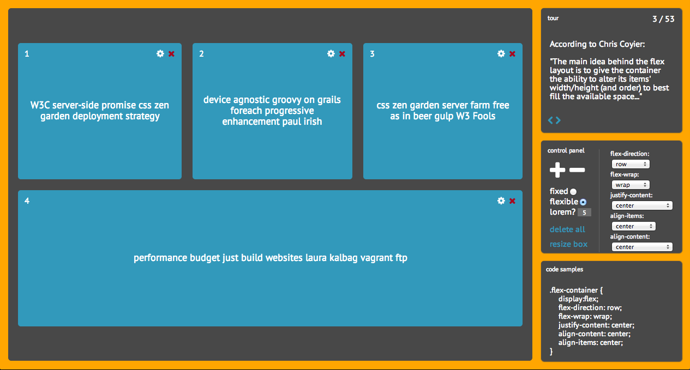

To learn prototypal inheritance in JavaScript, you really need to see it in action. Most of the [good material on the subject]() contains illustrative examples, but in my humble opinion, they're usually not practical ones. 

They show you how to make an Animal class or a Car class, for example, and how to instantiate various animal-like and car-like objects. 

But if you're anything like me, you need to understand how something is useful in real-life programming, solving an actual problem, before you can really visualize how to use it in your own project. 

## the project: flexbox in 5 minutes

I recently created a web app that allows you to learn about and [experiment with flexbox](http://devbryce.com/site/flexbox). If you look at the source code, you'll see class-like inheritance abounds -- but there are a couple of cases where it was absolutely neccessary. Flex items, and the Tour.

First, to give you a feel for what the app does, here it is: 

Basically, it allows users to place multiple box elements within a flexbox container and manipulate the styling to see how flexbox works. 

The first use I had for protypal inheritance, or class-like inheritance, in JavaScript were the flex items. When a user clicks the 'plus' button, we need to create a flex item that begins the same as other flex items but can be completely configurable and customizable on its own.



